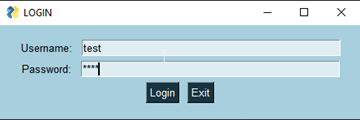
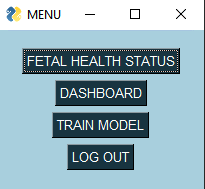
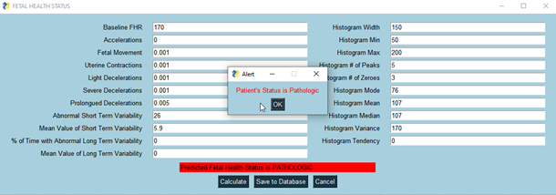
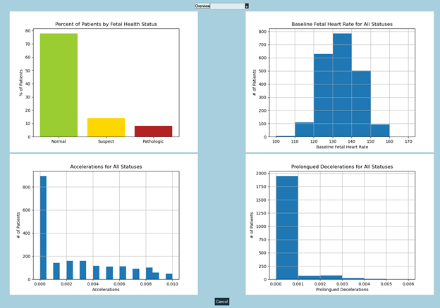
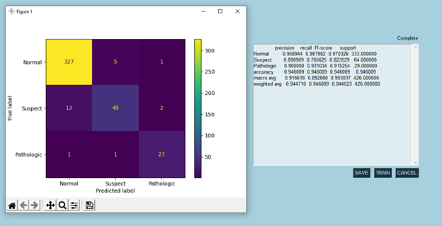

# Fetal Health Predictor

## Description
This Python application was developed to fulfill the requirements for a computer science capstone project at WGU. It uses machine learning to classify fetal health status using cardiac and uterine data from cardiotocographs. The data was analyzed and explored in a Jupyter Notebook using Matplotlib, NumPy, and Pandas. An SQLite database was used for data storage, retrieval, and security. Machine learning models were created using a random forest classifier and 5-fold cross-validation from Scikit-learn.

## Application Files
Application files are located in the folders listed below as well as in the *application-files.zip* file.

**py-files**
* *main.py*: The main entry to the program
* *dbinter.py*: Called by main.py to connect to database
* *window.py*: Called by main.py to control GUI
* *model.py*: Called by window.py to train and update model

**models**
* *new_model.joblib*: The model used by the application
* *baseline_rf.joblib*: Copy of initial model used by the application (new_model.joblib is overwritten each time a new model is trained)

**data**
* *fetal_health_db.db*: SQLite database file for fetal health data and user login data
* *fetal_health.csv*: Dataset from [Kaggle](https://www.kaggle.com/andrewmvd/fetal-health-classification)
* *CTG.xls*: The original dataset from [UCI](https://archive.ics.uci.edu/ml/datasets/cardiotocography)

**data-exploration**
* *fetal-health-data-exploration.ipynb*: Jupyter Notebook containing initial data exploration and modeling
* *fetal-health-data-exploration.html*: HTML file containing initial data exploration and modeling (same information as .ipynb file but for quicker/easier viewing)

**logs**
* *error_log.txt*: Catalogs application errors; created by the application if not found
* *user_log.txt*: Tracks user logins; created by the application if not found

## Installation
Prerequisites:
* DB Browser for SQLite 3.12.1
* Python 3.8.5 with the following libraries:
  * Joblib 1.0.0
  * Matplotlib 3.3.2
  * NumPy 1.19.2
  * Pandas 1.2.1
  * PySimpleGUI 4.34.0
  * Scikit-learn 0.23.2
  * Seaborn 0.11.1
  * SQLite 3.33.0

Steps:
1.	Install the prerequisite applications
2.	Extract files from *application-files.zip*
3.	Create a new user or skip this step if using the default admin account (username: admin; password: admin)
a.	Open fetal_health_db.db in DB Browser for SQLite
b.	Insert new record in the user table, making sure to memorize username and password as well as set active = 1. 
4.	Run main.py in Python
5.	Example data for input is available in Section E of *write-up.pdf* under “Example Fetal Health Data for Testing”

## Using the Application
The login screen will appear upon starting the application.

Enter your credentials and click the “Login” button. Once logged in, the menu will appear.

To predict fetal health status or to enter new data into the database, select the “FETAL HEALTH STATUS” button.

At this screen, you must enter data into each field before continuing. An error message will appear if the application suspects a typo. After selecting “Calculate”, the predicted fetal health status will appear. To save the data to the database, click “Save to Database”. A new window will appear asking you to confirm the actual health status of the patient. Choose a health status from the dropdown menu and click “Save” to continue. Otherwise, select “Cancel” to return.

To analyze fetal health data, select the “DASHBOARD” button.

At this screen, you can select which kind of visualization you would like to access from the dropdown menu at the top of the screen. To return to the main menu, select the “Cancel” button at the bottom of the screen.

To retrain the model on the data, select "TRAIN MODEL" from the menu.

On this screen, you can select "TRAIN" to initiate the model training. This may take several minutes to complete. Once complete, a new window with a confusion matrix will appear. This shows the number of predictions for each combination of a predicted label (on the x-axis) and a true label (on the y-axis). Correct predictions will appear in the boxes running diagonally from the upper-left corner to the lower-right corner. Additionally, a report will appear with the model’s performance metrics in the previous window. Click the “Save” button to save the model, overwriting the previous model. Alternatively, click the “Cancel” button to keep the original model and return to the main menu.

When you are finished, you can click the "LOG OUT" button to log out of your account. You can also close out the application by clicking the "X" in the upper right corner of the window. 

## Future Improvements
* Navigate to different screens within one window instead of closing current window and creating a new window each time
* Optimize colors and fonts for improved accessibility
* Improve formatting of model training report statistics (align columns and truncate digits to the right of decimal)
* Switch application to a web browser (using Flask and Heroku)
* Move database to web
* Record more data on database changes (add columns such as dateCreated, createdBy, dateUpdated, updatedBy)

## Project Status
This project was created for a capstone course. Development will be discontinued for the foreseeable future.
